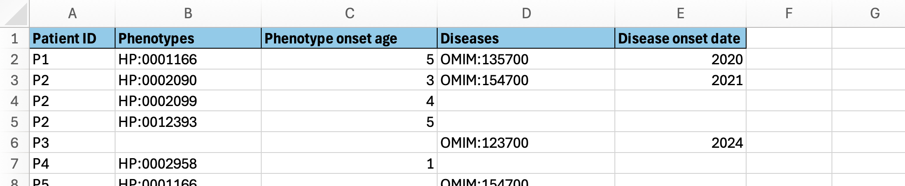

# Writing a PhenoXtract config.yaml file

In this README it will be explained how to write a `config.yaml` file for PhenoXtract.

<!-- TOC -->
* [Writing a PhenoXtract config.yaml file](#writing-a-phenoxtract-configyaml-file)
  * [Example config.yaml](#example-configyaml)
  * [Overview](#overview)
  * [data_sources](#data_sources)
    * [Excel data source](#excel-data-source)
    * [CSV data source](#csv-data-source)
    * [has_headers](#has_headers)
    * [patients_are_rows](#patients_are_rows)
    * [series_contexts](#series_contexts)
      * [identifier](#identifier)
      * [data_context](#data_context)
      * [header_context](#header_context)
      * [alias_map](#alias_map)
      * [building_block_id](#building_block_id)
  * [pipeline](#pipeline)
    * [strategies](#strategies)
    * [loader](#loader)
    * [meta_data](#meta_data)
      * [OMIM](#omim)
      * [LOINC](#loinc)
<!-- TOC -->

## Example config.yaml

Suppose we have the following Excel Workbook with two sheets called `Basic Info` and `Phenotypes and Diseases`.


<br>



Here is what a typical PhenoXtract `config.yaml` file for this data might look like:

```yaml
data_sources:
  - type: "excel"
    source: "./data/example.xlsx"
    sheets:
      - sheet_name: "Basic Info"
        has_headers: true
        patients_are_rows: true
        series_contexts:
          - identifier: "Patient ID"
            header_context: subject_id
          - identifier: "Year of birth"
            data_context: date_of_birth
          - identifier: "Sex"
            data_context: subject_sex
            alias_map:
              output_data_type: String
              mappings:
                "M": "MALE"
                "F": "FEMALE"
                "No data": null
      - sheet_name: "Phenotypes and Diseases"
        has_headers: true
        patients_are_rows: true
        series_contexts:
          - identifier: "Patient ID"
            header_context: subject_id
          - identifier: "Phenotypes"
            data_context: hpo
            building_block_id: "P"
          - identifier: "Phenotype onset age"
            data_context:
              onset: age
            building_block_id: "P"
          - identifier: "Diseases"
            data_context: disease
            building_block_id: "D"
          - identifier: "Disease onset date"
            data_context:
              onset: date
            building_block_id: "D"
pipeline:
  strategies:
    - "alias_map"
    - "date_to_age"
    - "age_to_iso8601"
  loader:
    file_system:
      output_dir: "./data/phenopackets"
      create_dir: true
  meta_data:
    created_by: "someone"
    submitted_by: "someone"
    cohort_name: "my_cohort"
    hpo_resource:
      id: "HP"
      version: "2025-09-01"
    disease_resources:
      - id: "OMIM"
        secrets:
          token: ${BIOPORTAL_API_KEY}
```

Not all data needs to be extracted; note that the "Name" column in the data is ignored by this config.yaml.

## Overview

The `config.yaml` has two main sections: `data_sources` and `pipeline`.

`data_sources` contains information on the tabular data (which may be CSV or Excel) being extracted. The user must input
the location of the file, and specify whether the table has headers, and whether rows or columns correspond to patients.
For each table, the user must specify a list of `series_contexts`. A Series Context is an association between a column
in the data, and a concept that PhenoXtract can understand. The two most important fields of a Series Context are
`identifier` and `data_context`. For example, this:

```yaml
          - identifier: "Year of birth"
            data_context: date_of_birth
```

tells PhenoXtract that the data in the column named "Year of birth" corresponds to the concept `DateOfBirth` that is
understood by PhenoXtract. See [Contexts](README_NEW.md#contexts) below for a list of all contexts understood by
PhenoXtract.

`pipeline` consists of three fields `strategies`, `loader` and `meta_data`. `strategies` is a list of Strategies,
which are applied to the data before any Collection occurs (
see [How PhenoXtract works](README_NEW.md#how-phenoxtract-works)).
`loader` specifies how the extracted Phenopackets should be outputted; currently the only option is `file_system`. In
the `meta_data` field, the user can input details about themselves and the cohort (this data will be put into
the [MetaData](https://phenopacket-schema.readthedocs.io/en/latest/metadata.html)
section of the Phenopackets), and also which resources they would like to use for processing ontology and database
classes.
There are currently five types of resource that can be specified:

- a `hpo_resource`
- a list of `disease_resources` (for example OMIM and MONDO)
- a list of `assay_resources` (for example LOINC)
- a list of `unit_resources` (for example UO)
- a list of `qualitative_measurement_resources` (for example PATO)

If the user only has phenotype and disease data, then only `hpo_resource` and `disease_resources` are relevant. The
resources provided by the user are used by PhenoXtract in order to validate the data, and to find labels corresponding
to IDs in the data, and vice-versa. The resources are either downloaded locally, or otherwise an API is used.

## data_sources

The field `data_sources` is a list of data sources, which can either have `type` "excel" or "csv". `data_sources` can
feature both CSV and Excel data sources. For example:

```yaml
data_sources:
  - type: "excel"
    source: "./data/example.xlsx"
    sheets:
      - sheet_name: "Basic Info"
        has_headers: true
        patients_are_rows: true
        series_contexts:
          - identifier: "Patient ID"
            header_context: subject_id
          - identifier: "Year of birth"
            data_context: date_of_birth
          - sheet_name: "Phenotypes"
            has_headers: true
            patients_are_rows: true
            series_contexts:
              - identifier: "Patient ID"
                header_context: subject_id
              - identifier: "Phenotypes"
                data_context: hpo
  - type: "csv"
    source: "./data/example.csv"
    separator: ","
    has_headers: true
    patients_are_rows: true
    series_contexts:
      - identifier: "Patient ID"
        header_context: subject_id
      - identifier: "Diseases"
        data_context: disease
```

would be the `data_sources` entries for data consisting of an Excel Workbook with two sheets, and a CSV file.

### Excel data source

An Excel data source has three fields: `type` (which is always "excel"), `source` (the path to the .xlsx file) and
`sheets` which is a list. The config for each sheet has the fields `sheet_name`, `has_headers`, `patients_are_rows`
and `series_contexts` which is a list of configs for a Series Context. More detail on the concepts will be provided
below.

### CSV data source

An CSV data source has six fields: `type` (which is always "csv"), `source` (the path to the .csv file), `separator`,
`has_headers`, `patients_are_rows` and `series_contexts`.

### has_headers

This is either `true` or `false`. If it is `true`, each column has a name in the data. The `identifier` of the
corresponding
Series Context must be the same as this. If `has_headers` is `false` then these columns will be indexed as integers
starting from 0. In this case, the `identifier` of the Series Context must be the corresponding integer.

### patients_are_rows

This is either `true` or `false`. If it is `true` then each row of the data corresponds to a single patient. If it is
`false` then each column of the data corresponds to a single patient (for example, if the first row of the data
contained just Patient IDs).

### series_contexts

`series_contexts` is a list of configs for a Series Context. The config for a Series Context consists of `identifier`,
`data_context`, `header_context`, `alias_map` and `building_block_id`.

#### identifier

`identifier` is the name of the associated column. It can also be a vector, if the user wants to associate the Series
Context with multiple columns:

```yaml
- identifier:
    - "Col_1"
    - "Col_2"
    - "Col_3"
```

If `identifier` is a single String, and there are no matches among the columns of the data, then Phenoxtract will treat
the string as a Regular Expression. For example: if `identifier` is "^HP:\d{7}$" then the Series Context will be
associated with all columns whose headers are HPO IDs of the form "HP:1234567".

#### data_context

This is the context for what is in the cells of the column. Default is None.

#### header_context

This is the context for what is in the header of the column. Default is None. Currently this is only relevant
if you have a HPO ID in the header of a column, and observation statuses (which should be "true" or "false") in the
cells. In that case, one should set `header_context` to be "hpo" and `data_context` to be "observation_status".

#### alias_map

The `alias_map` field is used in order to define how cells should be transformed when the AliasMap strategy is applied.
PhenoXtract expects cells to have a certain format. For example, if the context of the column is "subject_sex", then
all cells must either be empty, or be exactly "MALE" or "FEMALE". So one should set these as aliases appropriately, and
then apply the AliasMap strategy.

The `output_data_type` field of the `alias_map` strategy determines what data type the column should have after the
transformation is applied. Generally, this should be set to "String". But there are situations where "Boolean", "
Float64"
or "Int64" would be appropriate.

The `alias_map` field can have two formats. One can explicitly state the mappings in the `config.yaml` file like
so:

```yaml
alias_map:
  output_data_type: String
  mappings:
    "M": "MALE"
    "F": "FEMALE"
    "No data": null   
```

Alternatively, the user can direct PhenoXtract to a CSV which contains the aliases:

```yaml
alias_map:
  output_data_type: String
  mappings:
    path: "./data/aliases.csv"
    key_column_name: "KEYS"
    alias_column_name: "ALIASES"
```

In this case, the CSV might look something like:

```csv
KEYS,ALIASES
M,MALE
F,FEMALE
No data,
```

#### building_block_id

The `building_block_id` is a String which can associate certain columns together. For example:

```yaml
- identifier: "Phenotypes"
  data_context: hpo
  building_block_id: "P"
- identifier: "Phenotype onset age"
  data_context:
  onset: age
  building_block_id: "P"
- identifier: "Diseases"
  data_context: disease
  building_block_id: "D"
- identifier: "Disease onset date"
  data_context:
  onset: date
  building_block_id: "D"
```

In order for the "Phenotypes" Series Context to be associated with the "Phenotype onset age" Series Context, these
Series Contexts must have the same `building_block_id`, in this case, "P".

## pipeline

The `pipeline` field of the `config.yaml` file has three fields: `strategies`, `loader` and `meta_data`.

```yaml
pipeline:
  strategies:
    - "alias_map"
    - "date_to_age"
    - "age_to_iso8601"
  loader:
    file_system:
      output_dir: "./data/phenopackets"
      create_dir: true
  meta_data:
    created_by: "someone"
    submitted_by: "someone"
    cohort_name: "my_cohort"
    hpo_resource:
      id: "HP"
      version: "2025-09-01"
    disease_resources:
      - id: "OMIM"
        secrets:
          token: ${BIOPORTAL_API_KEY}
```

### strategies

PhenoXtract expects the data in a table to have a certain format before it can be collected and put into Phenopackets.
For example,
if a column has a Series Context with `data_context: hpo` then the cells of that column must either be HPO IDs, or
the primary label of that HPO term. The job of Strategies is to convert the data into this desired format. The list of
strategies can be found here: [Strategies](README_NEW.md#strategies)

### loader

`loader` specifies how the extracted Phenopackets should be outputted; currently the only option is `file_system`.

### meta_data

Whatever the user puts into `created_by` or `submitted_by` will be put directly into the MetaData section of the
Phenopackets [MetaData](https://phenopacket-schema.readthedocs.io/en/latest/metadata.html). The `cohort_name` will
become the prefix of the Phenopacket IDs. For example,
if a patient_id is "P001" and `cohort_name: "my_cohort"` then the Phenopacket ID will be "my_cohort-P001".

There are currently five types of resource that can be specified:

- a `hpo_resource`
- a list of `disease_resources` (for example OMIM and MONDO)
- a list of `assay_resources` (for example LOINC)
- a list of `unit_resources` (for example UO)
- a list of `qualitative_measurement_resources` (for example PATO)

If the user only has phenotype and disease data, then only `hpo_resource` and `disease_resources` are relevant. The
resources provided by the user are used by PhenoXtract in order to validate the data, and to find labels corresponding
to IDs in the data, and vice-versa. If a database or ontology is found in the data, and the user wants that data to be
in the Phenopackets, then that database or ontology should appear as a resource in `meta_data`.

For each resource, there are three possible fields: `id`, `version` and `secrets`. `id` is necessary. This will almost
always be the acronym generally used to refer to the resource. `version` is optional. If `version` is left empty, then
the latest version of the resource will be used. `secrets` is only needed if the resource can only be accessed via an
API.

Currently, PhenoXtract supports two kinds of resource.

- Ontologies: any ontology that can be found
  on [OBOLibrary](http://obofoundry.org)  will be downloaded and cached
  locally when PhenoXtract needs it for the first time.
- Non-ontology resources: these must be accessed via an API. Currently, the only two non-ontology resources that are
  supported are LOINC and OMIM.
-

#### OMIM

If PhenoXtract needs OMIM in order to understand diseases in the data, then in `meta_data`, one should find:

```yaml
disease_resources:
  - id: "OMIM"
    secrets:
      token: "my_bioportal_api_key"
```

where "my_bioportal_api_key" should of course be replaced by an actual API key
for [BioPortal](https://bioportal.bioontology.org).

Alternatively, one can write `token: ${BIOPORTAL_API_KEY}`, and put the API key into a .env file, found in the same
location as PhenoXtract, with the following info:

```txt
BIOPORTAL_API_KEY=my_bioportal_api_key
```

#### LOINC

If PhenoXtract needs LOINC in order to understand an assay, then in `meta_data`, one should find:

```yaml
assay_resources:
  - id: "LOINC"
    secrets:
      user: my_loinc_username
      password: my_loinc_password
```

Alternatively, one can write `user: ${LOINC_USERNAME}` and `password: ${LOINC_PASSWORD}`, and put the username and
password
in a .env file, found in the same location as PhenoXtract, with the following info:

```txt
LOINC_USERNAME=my_loinc_username
LOINC_PASSWORD=my_loinc_password
```


